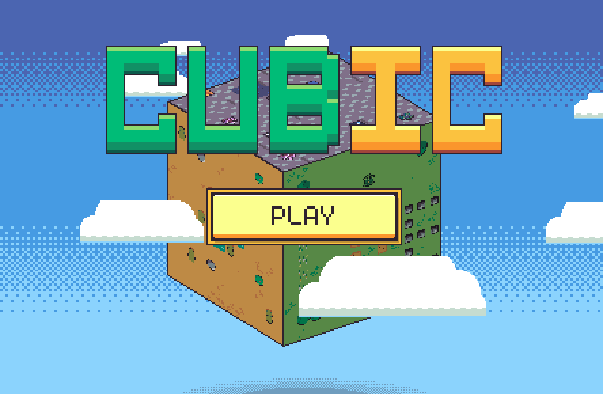
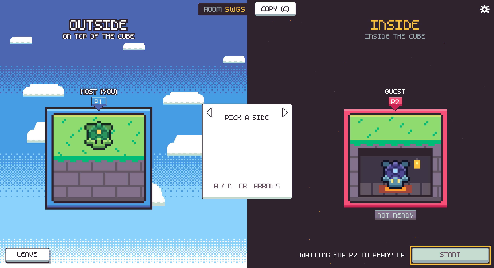
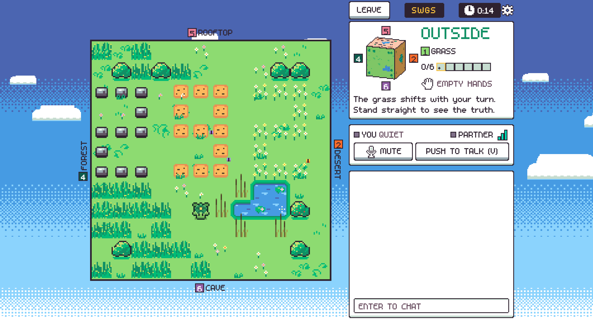
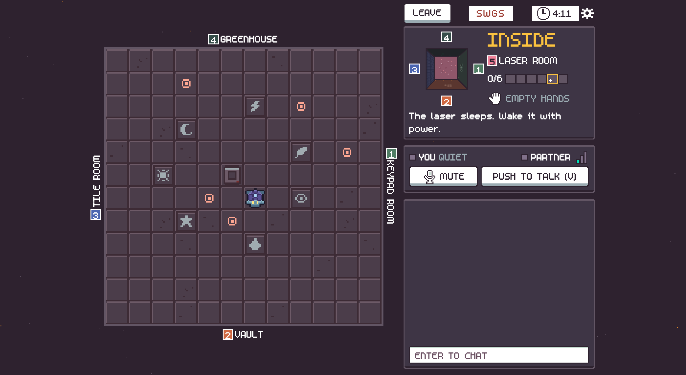
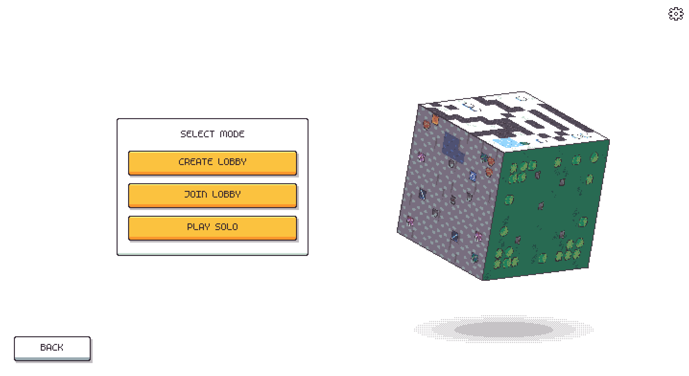
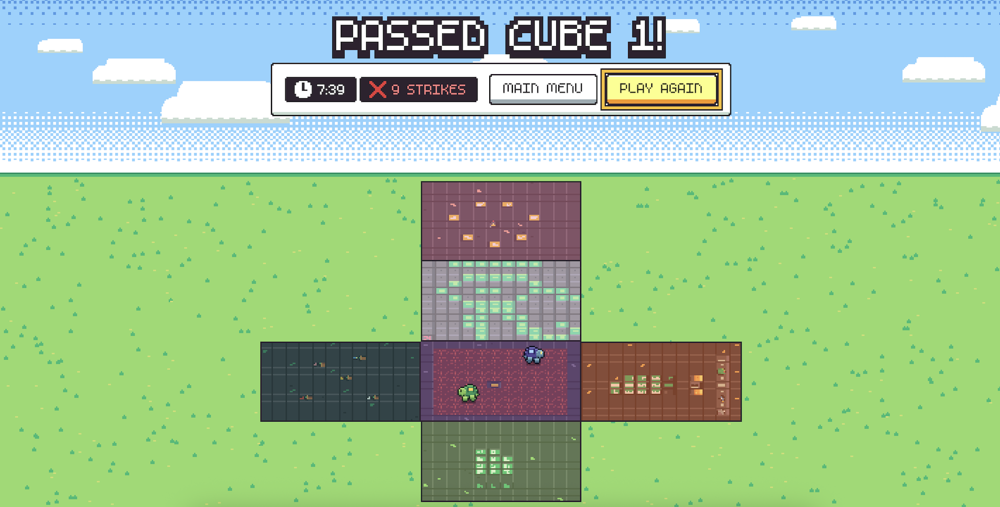
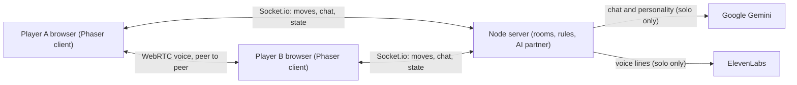

# Cubic

<p align="center">
  
</p>

Cubic is a two-player co-op game where one player walks the outside of a cube and the other is trapped inside, and you solve puzzles together by talking each other through the walls.

**Play now:** [playcube.tech](https://playcube.tech) (main) or [cubic-tau.vercel.app](https://cubic-tau.vercel.app) (backup).

Built by team Turtles at StormHacks 2026.

## Contents

1. [How it works](#how-it-works)
2. [Game modes](#game-modes)
3. [The six faces](#the-six-faces)
4. [Controls](#controls)
5. [Features](#features)
6. [How we built it](#how-we-built-it)
7. [Tech stack](#tech-stack)
8. [Run it locally](#run-it-locally)
9. [Deploy](#deploy)
10. [Tests](#tests)
11. [Project structure](#project-structure)
12. [Credits](#credits)

## How it works

A cube has six faces. One player (OUTSIDE) walks on the outer side of those faces. The other (INSIDE) walks on the inner side of the same six walls. Walk off the edge of a face and you cross onto the next one.

<p align="center">
  
</p>

The two sides are not the same view:

- **You cannot see each other's screen.** Each player sees only their own side. Puzzles are split so that neither side can solve one alone. One side holds the clue and the other holds the controls.
- **The inside is mirrored.** The inside player sees every wall from behind, so left and right are flipped compared with the outside.
- **The cube bends your sense of direction.** Three faces meet at each corner, so three left turns around a corner bring you home. Walking a loop around a corner turns you by 90 degrees. The HUD shows a compass drift (how far your "up" has turned from the face's own up), and the little cube in the HUD turns with it.
- **Proximity voice.** You talk through the wall with your microphone. If you are both on the same face, you hear each other clearly. On adjacent faces your partner is quieter. On opposite faces you hear nothing. There is also a text chat.
- **Solo mode.** With no second player, an AI partner takes the other side.

<table>
  <tr>
    <td align="center"></td>
    <td align="center"></td>
  </tr>
  <tr>
    <td align="center">The outside player on the grass of face 1</td>
    <td align="center">The inside player in the laser room of face 5</td>
  </tr>
</table>

## Game modes

<p align="center">
  
</p>

- **Create Lobby** makes a room and shows a 4-letter room code. You are the host. Pick a side, wait for your partner to be ready, then press Start.
- **Join Lobby** asks for the room code from your friend.
- **Play Solo** lets you pick a side. The AI partner takes the other one.

Refreshing the page puts you back in your seat if you come back soon (see [reconnect grace](#reconnects-and-inactivity)).

## The six faces

There is one puzzle per face. Neither player can finish one alone.

| Face | Name | Outside player | Inside player |
| --- | --- | --- | --- |
| 1 | Grass / Keypad room | Reads the 3-digit number laid out in the grass. It only reads right when the view is upright (compass drift 0). | Types it on the floor keypad, then ENTER. |
| 2 | Desert / Vault | Counts the bushes, rocks and birds. | Works out the vault code from the counts and types it. The safe opens. |
| 3 | Snow / Tile room | Describes the symbol carved in the snow. | Flips floor tiles until they match it, mirrored. |
| 4 | Forest / Greenhouse | Collects five flowers and plants each in the pot the partner names. | Sees which pot holds which colour. |
| 5 | Rooftop / Laser room | Calls the order the seven symbols light up in. | Puts the battery in the emitter and presses the symbols in that order. |
| 6 | Cave / Lava room | Pushes two mirrors so the laser beam burns the crate on the edge, then reads the beam's route out loud. | Follows that route over the lava to a button. A wrong step is a strike. |

The puzzles are linked by items that travel between faces:

- **Battery:** opening the safe on face 2 gives the inside player a battery for the emitter on face 5.
- **Laser:** solving face 5 switches on the laser beam on face 6.
- **Flower:** solving face 6 gives the outside player the fifth flower that face 4 needs.

Faces 1 and 3 stand alone. Every game uses a new random seed, so codes, counts and orders change each time.

The game is won the moment all six puzzles are solved. The end screen shows your time and strikes next to the unfolded cube.

<p align="center">
  
</p>

## Controls

The mouse is never required. These are the default keys, read from `client/src/input/bindings.ts`.

| Key | Gamepad | Action |
| --- | --- | --- |
| W A S D or arrow keys | d-pad or left stick | Move. In a menu, move the focus. |
| E | A | Pick up or drop an item, or use the tile you stand on (keys, buttons, flip tiles). In a menu: select. |
| Q | B | Drop the item you carry. In a menu: back. |
| V (hold) | | Push to talk |
| M | | Mute or unmute your mic |
| Tab (hold) | | Show the full cube map |
| 1 2 3 4 | | Quick chat: "Here!", "Wait", "Yes", "No" |
| Enter | | Open the chat. Enter sends, Esc closes. |
| Esc | Start | Pause menu |

**Rebinding.** Open Settings (the gear, or the pause menu) and go to the CONTROLS tab. You can rebind move, interact, drop, push to talk, mute, cube map and the four quick chat keys, and reset them to the defaults. Esc, Enter and the arrow keys are fixed. The arrow keys always work as a second way to move.

**Push to talk.** In Settings, the Mic row switches between Open and Push to talk. Hold the talk key (V by default) to speak in push-to-talk mode.

**Gamepad.** Any standard gamepad works through the browser Gamepad API. The gamepad is not rebindable, and it keeps working whatever you bind on the keyboard.

**Touch.** On phones and tablets the game shows on-screen controls: a d-pad, USE, DROP, TALK (hold), MAP, MENU and CHAT. They send the same keys as the keyboard.

## Features

### Accessibility

Settings has three tabs: SOUND, ACCESS and CONTROLS.

- **Text size:** S, M or L.
- **High contrast** mode.
- **Reduce motion:** swaps the face-crossing animations and the swaying scenery for quick fades and still frames.
- **Screen shake** can be turned off.
- **Hints** can be turned off.
- **Captions:** everything the AI partner says out loud also appears as a caption, and a "Partner speaking" tag shows when a human partner talks on the mic.
- **Keyboard-only play:** every menu, the lobby, the settings and the game can be used without a mouse.
- Separate volume sliders for master, music, effects and voice chat, and a mute for your mic.

### Phones and tablets

The layout is chosen from the visible size, the pixel density and whether the main pointer is a finger. It does not look at the device name. Wide screens get the full layout, smaller ones fold the side column behind a HUD button, and a rotate card asks for landscape when a touch screen is held upright. Whole-number pixel scaling keeps the pixel art sharp.

### Reconnects and inactivity

- **Reconnect grace.** If a player drops or refreshes during a game, their seat is held for 60 seconds so they can rejoin. In the lobby the hold is 15 seconds.
- **Inactivity.** Each human has their own idle clock. After 4 minutes with no key, tap, move, chat or talking, a countdown appears in the chat. 60 seconds later only that player is removed. The other player keeps the room. Both times can be changed with `INACTIVE_MS` and `INACTIVE_WARN_MS` on the server.
- Rooms live in server memory. A server restart or a new deploy ends every room.

### The cube HUD and map

The HUD shows a small 3D cube that turns with your compass drift. The outside player sees a solid cube. The inside player sees a room from within. Hold Tab to open the full cube map. Labels around the play area name the neighbouring faces, and a progress bar shows how many of the six puzzles are solved.

## How we built it



### Monorepo and server-authoritative state

The repo is an npm workspaces monorepo written in TypeScript:

- `shared` holds all the game logic: the cube math, the rules, the six puzzles, the maps and the AI partner's script. It has no DOM and no networking, and it needs no build step. Both the server (through `tsx`) and the client (through Vite) read it as TypeScript source.
- `server` is Node.js with Socket.io. It owns the game state, checks every move with the code in `shared`, and relays chat and voice signaling.
- `client` is the Phaser 4 game and the HTML interface, built with Vite.

The client draws and the server decides. A client predicts its own move with the same shared code, then accepts the server's state. The server also limits how fast moves and chat can arrive.

### The cube math

The cube has 6 faces, and each face is a 12 by 12 grid of tiles. Each face has its own "up" and its own screen direction, and the same tile coordinates are used on both sides, so inside `(x, y)` sits directly behind outside `(x, y)`. When you walk off a face edge, the shared code moves you to the neighbouring face and turns your "up" to match. Walking a loop around a corner leaves you rotated by 90 degrees. For the inside player, screen right is flipped, so every wall is seen from behind. Puzzles compare tiles, never screen directions, so they work the same from both sides.

### The AI partner

- **Scripted movement.** The partner is a rule-based bot in `shared/src/bot`. It sees only what its side can see, finds you by voice or by the face you name, walks with the real game rules and avoids tiles that are not safe, such as hot lava. Each puzzle has its own small script in `shared/src/bot/scripts`, and all six have one.
- **Gemini for chat only.** If `GEMINI_API_KEY` is set, Gemini rewords small talk, answers free-form chat and turns it into words the script understands. It never has to be right for the game to work. It is called at most once every 6 seconds per room, with a 3 second deadline. The server also caps it at 8 calls a minute, 25 calls per game and `GEMINI_DAILY_CAP` calls per UTC day (default 200), and pauses all calls for 10 minutes after a rate-limit (429) answer. Whenever Gemini is off, late, over a cap or failing, the script's own line is said instead. With no key, or with `AI_FAKE=1`, the scripted partner plays alone.
- **ElevenLabs voice bank.** The partner's fixed lines were generated once and committed as MP3 files in `server/tts/bank`, so they cost nothing at runtime. Answers that change every game (a code, an order, a path) are built from a small vocabulary of single-word clips (numbers, colours, symbols, directions and a few phrases, listed in `shared/src/bot/vocab.ts`) that the server chains together. Only Gemini's own free-form lines may be sent to ElevenLabs live, at most 20 per game and within a daily character cap. Anything else falls back to the browser's built-in voice.

## Tech stack

| Technology | What it does here |
| --- | --- |
| TypeScript | Every package is TypeScript, and shared logic is used as source by both server and client. |
| Node.js | Runs the game server (version 22.12 or newer). |
| Socket.io | Real-time connection between the browsers and the server: moves, state, chat, lobby, voice signaling. |
| Phaser 4 | Renders the game, the menus and the animated cube. |
| Vite | Dev server and production build for the client. |
| WebRTC | Peer-to-peer proximity voice between the two players, with public STUN and an optional TURN relay. |
| Web Audio | Sets the partner's volume from the face distance, and plays music and sound effects. |
| Google Gemini | Gives the solo AI partner natural chat and personality. Optional. |
| ElevenLabs | Speaks the AI partner's lines. Optional. |
| Playwright | Drives real browsers for the screenshot and end-to-end check scripts in `tools/screens`. |
| Vercel | Hosts the client. |
| Render | Hosts the server (free web service). |

## Run it locally

**Prerequisites:** Node.js 22.12 or newer (`engines` in `package.json`).

```bash
npm install
npm run dev
```

This starts the server on port 3001 and the client on port 5173. Open http://localhost:5173.

To try a two-player game, open the app in two separate browser windows (not two tabs, because a hidden tab pauses its game loop). In one window press Play, then Create Lobby. In the other, press Play, then Join Lobby and type the room code. The microphone works on `localhost`. To test across two computers, use an HTTPS tunnel, since browsers only allow the microphone on secure pages.

Nothing is required to run. The game works without any API key: the AI partner then plays from its script, and its lines are read by the browser voice.

### Environment variables

Copy `server/.env.example` to `server/.env` and `client/.env.example` to `client/.env.local`. Never commit real values.

| Variable | Where | What it is for |
| --- | --- | --- |
| `PORT` | server | Port the server listens on (3001 locally). Render sets it itself. |
| `CLIENT_ORIGIN` | server | Allowed browser origins, comma-separated. A `*` matches inside a host name. Localhost is always allowed when `NODE_ENV` is not `production`. |
| `INACTIVE_MS` | server, optional | Idle time before the countdown (default 240000). |
| `INACTIVE_WARN_MS` | server, optional | How long the countdown runs (default 60000). |
| `DEV_COMMANDS` | server, optional | Set to 1 to allow the `?dev` teleport and solve commands. Ignored in production. |
| `GEMINI_API_KEY` | server, optional | Turns on Gemini chat for the AI partner. |
| `GEMINI_MODEL` | server, optional | Gemini model (default `gemini-3.5-flash`). |
| `GEMINI_ENABLED` | server, optional | Set to false to switch Gemini off. |
| `GEMINI_DAILY_CAP` | server, optional | Gemini calls per UTC day over all solo rooms (default 200). |
| `AI_FAKE` | server, optional | Set to 1 to never call Gemini. |
| `AI_PERSONA` | server, optional | `default` or `tsundere`. Changes the partner's tone only. |
| `TTS_MODE` | server, optional | `browser` or `elevenlabs`. |
| `ELEVENLABS_API_KEY` | server, optional | Turns on live ElevenLabs speech. |
| `ELEVENLABS_ENABLED` | server, optional | Set to false to switch ElevenLabs off. |
| `ELEVENLABS_DAILY_CHARS` | server, optional | Characters per UTC day over all solo rooms (default 20000). |
| `ELEVENLABS_VOICE_ID` | server, optional | The partner's voice. The committed bank only plays for the default voice. |
| `ELEVENLABS_MODEL` | server, optional | Model for live lines (default `eleven_flash_v2_5`). |
| `ELEVENLABS_BANK_MODEL` | server, optional | Model the committed bank was made with (default `eleven_v4`). |
| `TURN_URLS`, `TURN_USERNAME`, `TURN_CREDENTIAL` | server, optional | A TURN relay for voice on strict networks. Set all three or none. |
| `VITE_SERVER_URL` | client | URL of the game server. Leave unset locally (Vite proxies `/socket.io` to port 3001). Required for the Vercel build. |

Other useful commands, all from the repo root: `npm test`, `npm run typecheck`, `npm run lint`, `npm run build` (builds the client) and `npm run maps` (bundles the Tiled maps in `maps/`).

Useful URLs while developing: `?mock=game` is a playable offline game with no server (add `&side=in` for the inside view), and `?dev` adds an overlay and teleport keys (the server needs `DEV_COMMANDS=1` for the server-side ones).

## Deploy

The client is on Vercel and the server is on Render. The settings live in `vercel.json` and `render.yaml`.

**Server on Render.** Create a Blueprint from this repo. `render.yaml` defines a free web service, `cubic-server`, with build `npm install`, start `npm start -w server` and health check `/health`. Set these variables in the Render dashboard (the ones marked `sync: false` in `render.yaml` are not stored in the file):

- `CLIENT_ORIGIN`: both client domains, comma-separated: `https://playcube.tech,https://cubic-tau.vercel.app`
- `GEMINI_API_KEY`, `ELEVENLABS_API_KEY`, `ELEVENLABS_VOICE_ID`: optional, for the AI partner.
- `TURN_URLS`, `TURN_USERNAME`, `TURN_CREDENTIAL`: optional voice relay.
- `render.yaml` already sets `NODE_VERSION`, `NODE_ENV`, the inactivity timers, `GEMINI_MODEL`, `AI_FAKE`, `AI_PERSONA`, `TTS_MODE`, `ELEVENLABS_MODEL` and `ELEVENLABS_BANK_MODEL`.

**Client on Vercel.** Import the repo with the root directory unchanged. `vercel.json` sets the install command, `npm run build -w client`, the output folder `client/dist` and a fallback to `index.html`. Set `VITE_SERVER_URL` to the Render URL with no trailing slash. It is read at build time, so redeploy after changing it, and the build fails on purpose if it is missing. The main domain is `playcube.tech`, with `cubic-tau.vercel.app` as the backup.

**Checking it.** `GET /health` on the server returns JSON with `ok`, the number of rooms and whether the asking origin is allowed. `GET /ice` returns the STUN (and TURN, if set) servers for voice.

**Free plan notes.**

- The Render free service sleeps after 15 minutes idle, and a cold start takes about 50 seconds. The client pings `/health` as soon as the lobby loads to wake it. Open the game a few minutes before a demo.
- Rooms are kept in memory only. Every restart or deploy (including each merge to `main`) ends all rooms, and players land on the mode screen with "That room is gone."
- The server's disk is not kept between deploys, so the live voice cache starts empty. The committed voice bank is part of the repo and always available.

## Tests

From the repo root:

```bash
npm test          # unit tests in shared, server and client
npm run typecheck
npm run lint
```

The shared tests include a solution script for every puzzle that plays it with real moves, so a puzzle that can no longer be solved fails the build. See `docs/puzzle-tests.md`.

The Playwright scripts live in `tools/screens`. They are not part of `npm test`. They are a separate package, so run `npm install` inside `tools/` first. Most need the dev server running, and each file starts with a comment that gives its exact setup.

```bash
cd tools
npm install
npx tsx screens/playtest.ts       # example: the full two-player regression pass
```

| Script | What it checks |
| --- | --- |
| `playtest.ts` | Two real players with real input: lobby, every face and edge on both sides, items, chat, settings, reconnects, all six puzzles and the win screen. |
| `solo-game.ts` | A whole solo game against the AI partner, through all six puzzles to the win screen. |
| `solo.ts` | The solo flow: mode screen, side popup, first frame from each side, Leave and Continue. |
| `ai.ts` | The AI partner: greeting, captions, voice, in a real browser. |
| `check.ts` | The menus with a real mouse in both Phaser renderers, with no console errors or dead buttons. |
| `a11y.ts` | Keyboard-only play of the whole game, with no mouse. |
| `controls.ts` | Key rebinding, swapping, reload persistence and gamepad. |
| `overlays.ts` | The HUD, settings and pause menu at every text size and with high contrast. |
| `mobile.ts` | The whole game with fingers only on emulated phones and a tablet. |
| `devices.ts` | 53 screen sizes on WebKit, Chromium and Firefox: the page fits, controls show only for touch. |
| `probe-fit.ts` | How the page fits an iPad-shaped window through rotation and toolbar changes. |
| `inactivity.ts` | The idle countdown, removal and return, with short timers. |
| `voice.ts` | The voice call: connect, hang up on leave, come back, survive a refresh (fake microphone). |
| `transitions.ts` | Face-crossing animations, input buffering and agreement between client and server. |
| `cube.ts`, `cubes.ts`, `hud.ts`, `hud-turn.ts` | The cube visuals and the HUD cube, in both renderers. |
| `faces.ts`, `world.ts`, `props.ts`, `lava.ts` | Pictures of every face from both sides, the living scenery, tall props and walking pace, and the lava room. |
| `side-select.ts`, `onboarding.ts`, `key-hint.ts` | The side select screen, every onboarding hint, and the controls hint strip. |
| `shoot.ts`, `submission.ts`, `title.ts` | Screenshot sets for every screen, and the submission pictures. |

`puzzles.ts` is retired and points to `playtest.ts`. `probe.ts`, `play.ts` and `quiet.ts` are helpers.

## Project structure

```
shared/     All game logic, no DOM and no networking
  src/cube.ts, game.ts     Cube math, moves, interaction, ticks
  src/puzzles/             The six puzzles, one file each
  src/maps/                Map format and loaders
  src/bot/                 The AI partner: observe, decide, path, per-puzzle scripts
  src/voice.ts             How loud the partner is, from face distance
server/     Node + Socket.io
  src/rooms.ts             Rooms, lobby, validation, seat hold, inactivity
  src/app.ts               HTTP routes (/health, /ice) and origin checks
  src/ai/                  AI runner, Gemini, caps, ElevenLabs voice
  tts/bank/                The committed voice clips
client/     Phaser 4 + Vite
  src/game/                The playable scene, rendering, input
  src/net/                 Socket client and prediction
  src/voice/               WebRTC and Web Audio voice
  src/input/               Key bindings, gamepad, touch
  src/ui/                  HUD, settings, pause menu, captions, mobile controls
  src/scenes/              Title, mode and lobby scenes
  public/assets/           Art, fonts and audio
maps/       Tiled maps
tools/      Pixel art generator and Playwright scripts (its own package)
docs/       Design notes, AI partner docs, puzzle test docs, README pictures
```

More detail: `CLAUDE.md` (architecture notes), `docs/ai-partner.md` (AI partner interfaces), `docs/puzzle-tests.md` (puzzle tests), `docs/style.md` (look and feel).

## Credits

- Built by team Turtles at StormHacks 2026.
- Music by Kevin MacLeod ([incompetech.com](https://incompetech.com)), licensed under [Creative Commons: By Attribution 4.0](https://creativecommons.org/licenses/by/4.0/). Tracks: "Morning", "Clear Air", "Windswept", "Immersed" and "Enchanted Journey". Full details and the changes we made are in [CREDITS.md](CREDITS.md).
- AI partner voice by [ElevenLabs](https://elevenlabs.io).
- Turtle sprites and the pixel art are by our team. The sound effects are synthesized in code.
